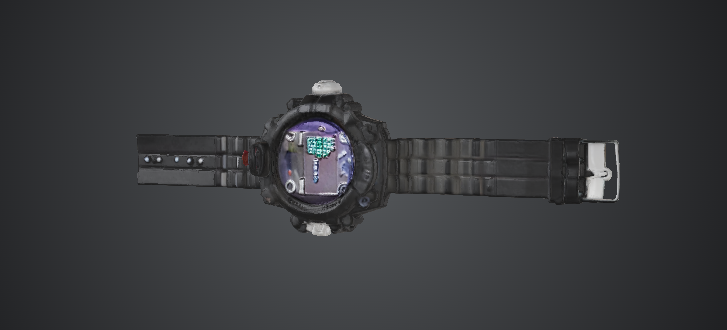
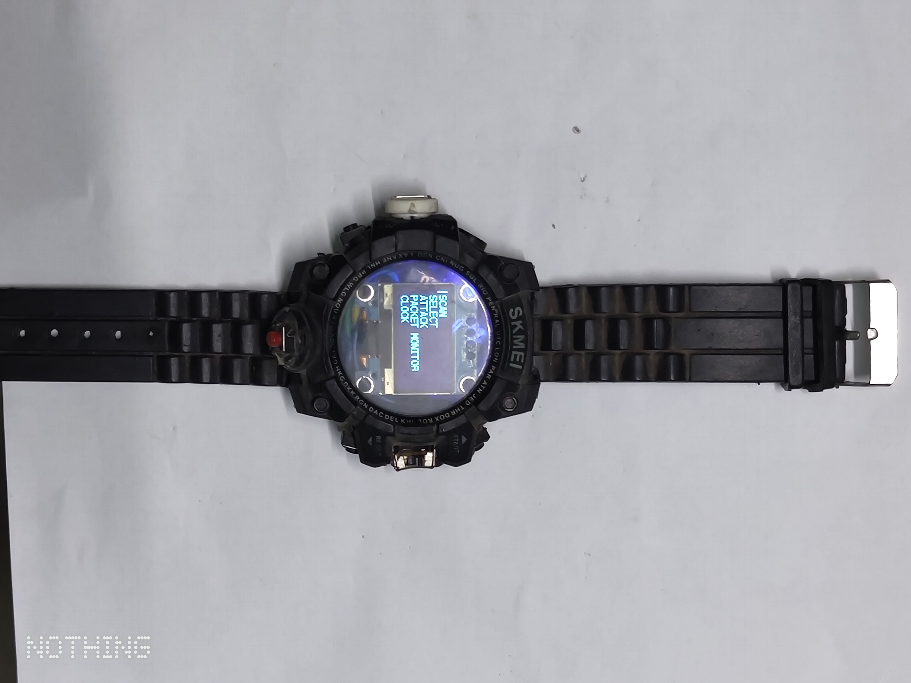
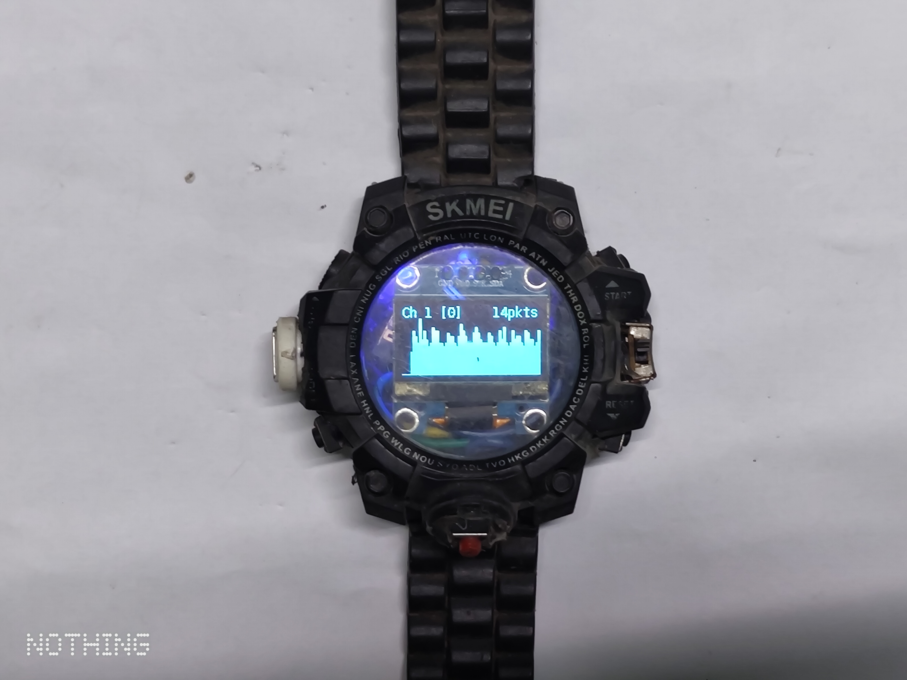
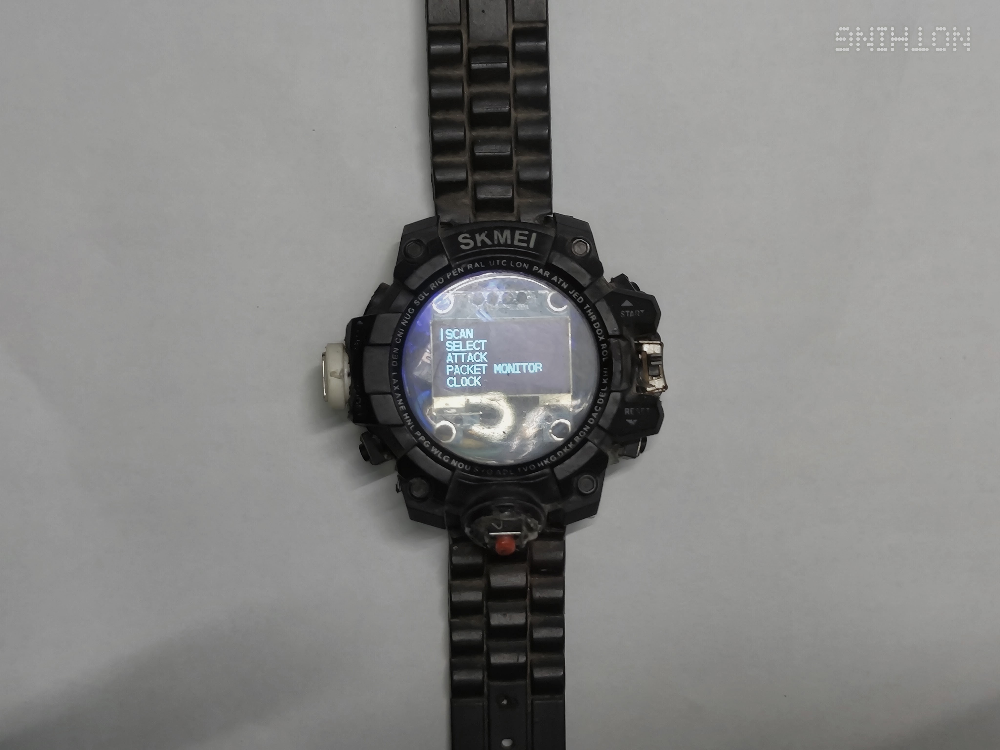

<div align="center">

# Orbit ⌚⚡

**A wearable WiFi security-testing platform, disguised as a wristwatch.**

Custom ESP8266 hardware inside a repurposed SKMEI watch case, running a modified build of Spacehuhn's ESP8266 Deauther. This repository is the complete build: KiCad schematics, bill of materials, 3D enclosure model, and adapted firmware.

[](./LICENSE)
[](#hardware)
[](#status)
[](../../releases/latest)
[](../../commits/main)

[Overview](#overview) • [Hardware](#hardware) • [Firmware](#firmware) • [3D Model](#3d-model) • [Gallery](#gallery) • [Legal](#legal--ethical-use)

</div>

---

## Overview

Orbit turns a raw ESP-12E/F module into a wrist-worn WiFi security testing tool. It presents a small on-device menu — **Scan**, **Select**, **Attack**, **Packet Monitor**, **Clock** — navigated with three tactile buttons, and reports live channel activity on a 128×64 OLED.

| | |
|---|---|
| **Form factor** | Modified SKMEI digital watch case |
| **MCU** | ESP-12E / ESP-12F (ESP8266) |
| **Display** | 1.3" I2C OLED (SH1106, 128×64) |
| **Input** | 3× tactile buttons (Up / Down / OK) + Flash + Reset |
| **Status LED** | WS2812B addressable RGB |
| **Power** | 3.7V single-cell LiPo |
| **Firmware base** | [Spacehuhn ESP8266 Deauther](https://github.com/SpacehuhnTech/esp8266_deauther) (MIT), re-pinned and rebranded |

This repo covers both halves of the build:

- **`hardware/`** — KiCad schematics for the main board and a standalone FT232RL-based flasher board, with PDF/SVG exports so nothing requires KiCad installed to review.
- **`firmware/`** — the Deauther source, adapted to Orbit's exact GPIO map, plus a prebuilt binary in [Releases](../../releases).

> [!WARNING]
> Orbit can interfere with wireless communications (deauthentication, scanning, packet capture). Use it only on networks you own or are explicitly authorized in writing to test. Unauthorized use may violate wireless regulations (e.g. FCC Part 15 in the US) and computer-misuse laws in most jurisdictions. See [Legal & Ethical Use](#legal--ethical-use).

---

## Hardware

### Specifications

| Component | Spec |
|---|---|
| MCU | ESP-12E / ESP-12F (ESP8266) |
| Display | 0.96" I2C OLED (SSD1306, 128×32) |
| Buttons | 3× tactile (Up / Down / OK) + Flash + Reset |
| LED | WS2812B RGB, single pixel |
| Power | 3.7V single-cell LiPo, no regulator |
| Case | Modified SKMEI digital watch |

### Pinout

| Function | GPIO |
|---|---|
| Button UP | 14 |
| Button DOWN | 12 |
| Button OK | 13 |
| OLED SCL | 5 |
| OLED SDA | 4 |
| WS2812 DIN | 2 |
| Flash button | 0 |
| Reset | RST |

### Bill of Materials

| Qty | Part |
|---|---|
| 1× | ESP-12E/F module |
| 1× | 0.96" I2C OLED (SSD1306, 128×32) |
| 1× | WS2812B RGB LED breakout |
| 5× | Tactile push buttons |
| 5× | 10kΩ resistors (boot config + pull-down) |
| 1× | 3.7V LiPo battery (400 mAh+) |
| 1× | SPST slide switch |
| 1× | FT232RL USB-TTL module (flasher board only) |
| — | SKMEI digital watch case (donor) |

### Schematics

Full KiCad source lives in [`hardware/`](./hardware). PDF and SVG exports are included alongside the `.kicad_sch` files for quick review without installing KiCad.

| Board | Purpose | Files |
|---|---|---|
| **Main board** | Orbit watch — ESP-12E, OLED, buttons, WS2812, battery | `hardware/orbit-main-circuit.kicad_sch` · [PDF](./hardware/orbit-main-circuit.pdf) · [SVG](./hardware/orbit-main-circuit.svg) |
| **Flasher board** | FT232RL USB-TTL programmer for initial flashing | `hardware/orbit-flash-circuit.kicad_sch` · [PDF](./hardware/orbit-flash-circuit.pdf) · [SVG](./hardware/orbit-flash-circuit.svg) |

> **Note:** on the flasher board, UART is crossed as expected for serial programming — FT232 TXD → ESP RXD0/GPIO3, FT232 RXD → ESP TXD0/GPIO1.

---

## Firmware

Orbit's firmware is a modified build of [spacehuhn's ESP8266 Deauther](https://github.com/SpacehuhnTech/esp8266_deauther) (MIT License), re-pinned to Orbit's GPIO map with a rebranded boot screen. See [`NOTICE.md`](./NOTICE.md) for the exact scope of modifications and attribution.

### Get the prebuilt binary

Grab `Orbit-firmware-v1.0.bin` from [**Releases**](../../releases/latest) and flash directly — no build environment required.

### Build from source

```bash
git clone https://github.com/shasradha/Orbit.git
cd Orbit/firmware/Orbit-Firmware-Source/orbit_deauther
```

1. Open `orbit_deauther.ino` in **Arduino IDE 2**.
2. Install the ESP8266 board package: *Tools → Board → Boards Manager → search "esp8266"*.
3. Select **Generic ESP8266 Module** as the target board.
4. Compile.

### Flashing

Use the included [flasher circuit](./hardware/orbit-flash-circuit.pdf) (FT232RL-based) or any USB-TTL adapter:

```bash
esptool.py -p <PORT> -b 115200 write_flash 0 Orbit-firmware-v1.0.bin
```

### Status

Compiles cleanly against Orbit's custom pin configuration. **Not yet flash-tested on physical hardware after this specific pin remap** — testing reports and issues are welcome. The underlying hardware, OLED wiring, and button layout have been verified working on this exact board (see [Gallery](#gallery)).

---

## 3D Model

A 3D reconstruction of the Orbit enclosure, built from real device photos and refined in Blender, is available for interactive preview:

**→ [Orbit — 3D Model (Tripo3D)](https://studio.tripo3d.ai/3d-model/440f1f53-c45f-4885-87b7-a15c8f742168?invite_code=AO12LG)**

This is an AI-assisted reconstruction for visual reference only — it is **not dimensionally exact**. The Blender source file is in [`hardware/3d/`](./hardware/3d) for anyone who wants to inspect or rebuild it.

<div align="center">

</div>

https://github.com/user-attachments/assets/320ed174-5218-427d-8676-f516c165184d

---

## Gallery

<table>
<tr>
<td width="50%">

<p align="center"><em>Orbit, assembled and running</em></p>
</td>
<td width="50%">

<p align="center"><em>Live WiFi channel activity monitor</em></p>
</td>
</tr>
</table>

<div align="center">

<p><em>On-device menu: Scan · Select · Attack · Packet Monitor · Clock</em></p>
</div>

---

## Roadmap

- [ ] Flash-test v1.0 firmware on the re-pinned hardware and confirm all menu functions
- [ ] Publish assembly / disassembly guide for the SKMEI case mod
- [ ] Add case STL/3MF export for 3D-printed enclosures
- [ ] Battery life benchmarking

---

## Contributing

Issues and pull requests are welcome — particularly flash-test reports, hardware revisions, and firmware fixes. For anything touching the deauther core itself, consider contributing upstream to [SpacehuhnTech/esp8266_deauther](https://github.com/SpacehuhnTech/esp8266_deauther) as well.

---

## Legal & Ethical Use

This project is published for **authorized security research and education only**.

- Only test networks you own, or have explicit written authorization to test.
- Deauthentication and RF interference are regulated in most jurisdictions (e.g. FCC Part 15 in the US) — unauthorized use may violate wireless and computer-misuse law.
- Per the upstream license: **do not redistribute, advertise, or sell this software (or Orbit) as a "jammer."**
- The author is not responsible for misuse of this tool.

---

## Credits

- **[Spacehuhn Technologies](https://github.com/SpacehuhnTech)** — original ESP8266 Deauther firmware (MIT License)
- **[Shasradha Karmakar](https://github.com/shasradha)** — hardware design, KiCad schematics, GPIO remap, and firmware adaptation for the Orbit platform

---

## License

MIT — see [`LICENSE`](./LICENSE) for the original firmware license and [`NOTICE.md`](./NOTICE.md) for Orbit-specific hardware and firmware modifications. Hardware design (KiCad files, BOM, 3D model) is also released under MIT.

</div>
